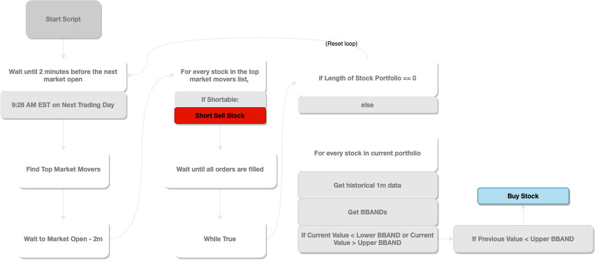

# Trading Demo

Algorithmic trading demo for portfolio site: (not up yet)

## How System Works

## Setup

1. Install the Github repo
2. Install requirements via  `pip install -r requirements.txt`
3. Install TWS 979 if you haven't already 
- Make sure "Enable ActiveX and Socket Clients" is checked
- Set the Port to 7496 (7497 by default usually)
4. Get your User ID (should be in the top right corner of your TWS terminal)
5. Set "ACCOUNT_ID" in CustomIBAPI.py to your User ID
6. Run demo_trader.py in terminal
